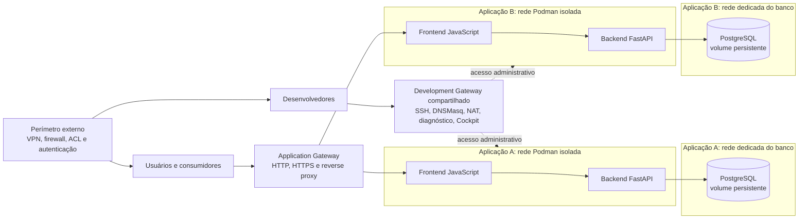

<details>
    <summary>Índice</summary>
    <ol>
        <li><a href="#visão-geral">Visão Geral</a></li>
        <li><a href="#arquitetura">Arquitetura</a></li>
        <li><a href="#estrutura-do-repositório">Estrutura do Repositório</a></li>
        <li><a href="#modelo-de-desenvolvimento">Modelo de Desenvolvimento</a></li>
        <li><a href="#pré-requisitos">Pré-requisitos</a></li>
        <li><a href="#como-rodar-localmente">Como Rodar Localmente</a></li>
        <li><a href="#containers-e-redes-podman">Containers e Redes Podman</a></li>
        <li><a href="#implantação-e-operação">Implantação e Operação</a></li>
        <li><a href="#configuração-e-segurança">Configuração e Segurança</a></li>
        <li><a href="#decisões-em-aberto-e-próximas-etapas">Decisões em Aberto e Próximas Etapas</a></li>
        <li><a href="#licença-e-contribuição">Licença e Contribuição</a></li>
    </ol>
</details>

## Visão geral

Este repositório é a base planejada para aplicações web com backend Python/FastAPI, frontend
JavaScript e PostgreSQL, executadas em containers Podman. A arquitetura prioriza isolamento entre
aplicações, desenvolvimento remoto com VS Code, implantação reproduzível e baixa dependência
operacional do host.

O contrato arquitetural está em
[docs/plans/WEB_APP_BOILERPLATE_ARCHITECTURE.md](docs/plans/WEB_APP_BOILERPLATE_ARCHITECTURE.md).
Ele descreve o ambiente-alvo RHEL 9, os gateways, as redes, o acesso SSH, o DNS de desenvolvimento,
os secrets e os critérios para a implementação.

**Estado atual:** a arquitetura é uma proposta para orientar a implementação. O código existente é
apenas um scaffold Python; ainda não há aplicação web, containers ou scripts de deployment.

<div> <a href="#visão-geral" title="De volta ao topo da página"> <picture> <source media="(prefers-color-scheme: dark)" srcset="./docs/images/up-arrow_white.svg">  </picture> </a> <br><br> </div>

## Arquitetura

A arquitetura separa o acesso de desenvolvimento, o tráfego das aplicações e o perímetro de
segurança administrado pela infraestrutura:



Componentes e limites principais:

- **Development Gateway:** um container administrativo compartilhado, conectado às redes das
  aplicações. Oferece SSH, DNS de desenvolvimento, forwarding, diagnóstico, Cockpit e
  `cockpit-podman`. Não serve tráfego de usuários.
- **Application Gateway:** componente separado para acesso HTTP/HTTPS às aplicações. Não é canal
  de manutenção dos containers.
- **Containers da aplicação:** backend, frontend e serviços auxiliares independentes. Cada
  aplicação mantém sua própria rede Podman.
- **PostgreSQL:** container com volume persistente, acessível normalmente apenas pelo backend na
  rede dedicada ao banco.
- **Perímetro de segurança:** VPN, firewall, ACL e autenticação externa ao boilerplate. O Development
  Gateway não substitui esses controles nem funciona como firewall de autorização.

<div> <a href="#visão-geral" title="De volta ao topo da página"> <picture> <source media="(prefers-color-scheme: dark)" srcset="./docs/images/up-arrow_white.svg">  </picture> </a> <br><br> </div>

## Estrutura do repositório

O repositório ainda contém somente o scaffold inicial. A estrutura lógica prevista separa aplicação,
gateways e operações de deployment:

```text
repository/
├── backend/                 # API Python/FastAPI
├── frontend/                # Interface JavaScript
├── gateway/
│   ├── development/         # Gateway administrativo compartilhado
│   └── application/         # Gateway de acesso às aplicações
├── database/                # Inicialização e recursos do PostgreSQL
├── deploy/                  # Scripts idempotentes de implantação
├── config/                  # Configuração estrutural versionada
├── compose/                 # Definições dos serviços e redes Podman
├── docs/
│   └── plans/               # Contratos e planos arquiteturais
├── scripts/
├── src/
│   └── main.py              # Scaffold atual
└── pyproject.toml           # Configuração do projeto Python
```

Os nomes e a disposição finais podem evoluir durante a implementação. As responsabilidades e os
limites de segurança definidos no contrato arquitetural devem permanecer explícitos.

<div> <a href="#visão-geral" title="De volta ao topo da página"> <picture> <source media="(prefers-color-scheme: dark)" srcset="./docs/images/up-arrow_white.svg">  </picture> </a> <br><br> </div>

## Modelo de desenvolvimento

O desenvolvimento cotidiano deve ocorrer pelo VS Code, usando Git, terminal, testes e ferramentas
de debugging. O acesso remoto aos containers passa pelo Development Gateway; não exige acesso
administrativo permanente ao host RHEL.

O host de execução fornece Podman e armazenamento persistente. A equipe de infraestrutura realiza
a configuração inicial e operações excepcionais do host. Os containers permanecem substituíveis;
volumes preservam os dados que precisam sobreviver à recriação.

Desenvolvimento e produção mantêm a mesma separação de responsabilidades e isolamento de redes.
Recursos, secrets, certificados, réplicas e observabilidade podem variar por ambiente.

<div> <a href="#visão-geral" title="De volta ao topo da página"> <picture> <source media="(prefers-color-scheme: dark)" srcset="./docs/images/up-arrow_white.svg">  </picture> </a> <br><br> </div>

## Pré-requisitos

### Desenvolvimento

- Git;
- VS Code, recomendado para edição e acesso remoto;
- Python 3.14 ou superior;
- [UV](https://docs.astral.sh/uv/) para gerenciar o ambiente Python;
- Podman quando for necessário executar ou validar containers localmente.

### Ambiente remoto

- Red Hat Enterprise Linux 9 e Podman;
- armazenamento para volumes persistentes;
- equipe de infraestrutura com acesso administrativo para configuração inicial e operações do host;
- acesso SSH autorizado ao Development Gateway;
- controles externos de rede e autenticação definidos pela organização.

O contrato arquitetural não exige acesso administrativo diário dos desenvolvedores ao host. Os
requisitos de rede, capabilities e portas ainda serão definidos durante o desenho de implementação.

<div> <a href="#visão-geral" title="De volta ao topo da página"> <picture> <source media="(prefers-color-scheme: dark)" srcset="./docs/images/up-arrow_white.svg">  </picture> </a> <br><br> </div>

## Como rodar localmente

O scaffold atual não inicia uma API nem um frontend. Para executar o código Python existente:

```powershell
uv run python -m src.main
```

O comando imprime uma mensagem de exemplo. A execução do stack Podman e o acesso remoto ainda
dependem da implementação dos containers e scripts previstos na arquitetura.

<div> <a href="#visão-geral" title="De volta ao topo da página"> <picture> <source media="(prefers-color-scheme: dark)" srcset="./docs/images/up-arrow_white.svg">  </picture> </a> <br><br> </div>

## Containers e redes Podman

Cada aplicação terá uma rede Podman própria, com CIDR sem sobreposição. As redes não se comunicam
entre si por padrão. O Development Gateway poderá se conectar a várias redes para manutenção, sem
unificá-las.

O deployment deverá gerar ou atualizar os registros do DNSMasq para serviços de desenvolvimento
selecionados, usando nomes estáveis como `backend.project-a.dev.internal`. A configuração deverá
acompanhar a recriação dos containers; seus endereços IP não são identidades permanentes. A
publicação de um nome DNS não concede conectividade entre redes.

O SSH seguirá o mesmo limite: o Development Gateway encaminha conexões aos containers de aplicação,
mas a autenticação acontece no destino. O acesso SSH ao próprio gateway é autenticado pelo gateway.
Cada desenvolvedor usa sua própria chave; chaves privadas não são compartilhadas nem copiadas para o
ambiente.

O PostgreSQL terá volume persistente e rede dedicada. Em condições normais, somente o backend
precisa alcançar o banco; o frontend não acessa PostgreSQL diretamente.

<div> <a href="#visão-geral" title="De volta ao topo da página"> <picture> <source media="(prefers-color-scheme: dark)" srcset="./docs/images/up-arrow_white.svg">  </picture> </a> <br><br> </div>

## Implantação e operação

Scripts versionados deverão validar pré-requisitos, preparar diretórios, redes, volumes e secrets,
provisionar chaves públicas, atualizar os containers, gerar a configuração DNS e verificar a saúde
básica dos serviços. A implantação deverá ser idempotente e não poderá destruir dados persistentes
ou secrets ao ser repetida.

Cockpit e `cockpit-podman` serão as ferramentas administrativas previstas para estado, logs e
containers. O acesso ao Podman deverá usar preferencialmente o socket Unix; a API Podman não será
exposta diretamente por TCP sem decisão arquitetural explícita.

O deployment e a topologia ainda não estão implementados. A arquitetura mantém como decisões
abertas as capabilities do gateway, o mecanismo de acesso ao socket, a alocação de CIDRs, o gateway
de aplicação, health checks, logs, backups e atualização de imagens.

<div> <a href="#visão-geral" title="De volta ao topo da página"> <picture> <source media="(prefers-color-scheme: dark)" srcset="./docs/images/up-arrow_white.svg">  </picture> </a> <br><br> </div>

## Configuração e segurança

A configuração estrutural deverá ser versionada no Git: serviços, redes, portas, templates e
parâmetros do deployment. Senhas, tokens, chaves privadas e certificados privados ficam fora do
repositório. A primeira implementação prevê arquivos de secrets no host, montados somente para os
containers que precisam deles e em modo somente leitura.

Princípios obrigatórios:

- aplicar menor privilégio e evitar `--privileged`;
- não expor o socket/API do Podman por TCP sem necessidade aprovada;
- manter redes de aplicações isoladas;
- não expor PostgreSQL externamente por padrão;
- não incluir secrets nas imagens ou no Git;
- não montar secrets em serviços que não os utilizam;
- usar chaves SSH individuais e provisionar somente as chaves públicas;
- separar o gateway administrativo do gateway de aplicação;
- tratar o perímetro externo como responsabilidade da infraestrutura.

Os caminhos de host, as capabilities e os mapeamentos de volumes serão definidos no desenho técnico
de implementação. A integração com um Secret Manager e VPN específica fica fora da primeira versão.

<div> <a href="#visão-geral" title="De volta ao topo da página"> <picture> <source media="(prefers-color-scheme: dark)" srcset="./docs/images/up-arrow_white.svg">  </picture> </a> <br><br> </div>

## Decisões em aberto e próximas etapas

A arquitetura já estabelece RHEL 9, Podman rootful, backend FastAPI, frontend JavaScript, PostgreSQL,
um Development Gateway compartilhado, redes isoladas por aplicação, DNSMasq e secrets externos ao
Git. Permanecem em aberto:

- capabilities do Development Gateway e integração Cockpit/Podman;
- política de alocação de CIDRs;
- tecnologia do Application Gateway e framework JavaScript;
- backups, health checks, logs e atualização/versionamento de imagens;
- certificados TLS, VPN opcional e exposição dos endpoints de aplicação.

Próxima etapa recomendada: documentar topologia e portas, interfaces do gateway, fluxos de SSH, DNS
e NAT, volumes, capabilities e ciclo de vida de criação, atualização, remoção e recuperação. Validar
esse desenho contra RHEL 9 e Podman antes de implementar os serviços.

<div> <a href="#visão-geral" title="De volta ao topo da página"> <picture> <source media="(prefers-color-scheme: dark)" srcset="./docs/images/up-arrow_white.svg">  </picture> </a> <br><br> </div>

## Licença e contribuição

Consulte os arquivos de política e contribuição na raiz do repositório:

- [LICENSE.md](LICENSE.md)
- [CONTRIBUTING.md](CONTRIBUTING.md)
- [CODE_OF_CONDUCT.md](CODE_OF_CONDUCT.md)
- [SECURITY.md](SECURITY.md)
- [SUPPORT.md](SUPPORT.md)

Siga as diretrizes de contribuição e o código de conduta ao enviar alterações.

<div> <a href="#visão-geral" title="De volta ao topo da página"> <picture> <source media="(prefers-color-scheme: dark)" srcset="./docs/images/up-arrow_white.svg">  </picture> </a> <br><br> </div>