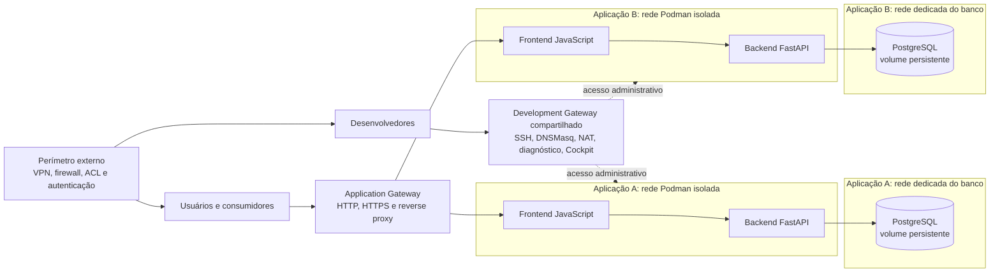

<details>
    <summary>Índice</summary>
    <ol>
        <li><a href="#visão-geral">Visão Geral</a></li>
        <li><a href="#arquitetura">Arquitetura</a></li>
        <li><a href="#estrutura-do-repositório">Estrutura do Repositório</a></li>
        <li><a href="#modelo-de-desenvolvimento">Modelo de Desenvolvimento</a></li>
        <li><a href="#pré-requisitos">Pré-requisitos</a></li>
        <li><a href="#como-rodar-localmente">Como Rodar Localmente</a></li>
        <li><a href="#containers-e-redes-podman">Containers e Redes Podman</a></li>
        <li><a href="#implantação-e-operação">Implantação e Operação</a></li>
        <li><a href="#configuração-e-segurança">Configuração e Segurança</a></li>
        <li><a href="#decisões-em-aberto-e-próximas-etapas">Decisões em Aberto e Próximas Etapas</a></li>
        <li><a href="#licença-e-contribuição">Licença e Contribuição</a></li>
    </ol>
</details>

## Visão geral

Este repositório é a base planejada para aplicações web com backend Python/FastAPI, frontend
JavaScript e PostgreSQL, executadas em containers Podman. A arquitetura prioriza isolamento entre
aplicações, desenvolvimento remoto com VS Code, implantação reproduzível e baixa dependência
operacional do host.

O contrato arquitetural está em
[docs/plans/WEB_APP_BOILERPLATE_ARCHITECTURE.md](docs/plans/WEB_APP_BOILERPLATE_ARCHITECTURE.md).
Ele descreve o ambiente-alvo RHEL 9, os gateways, as redes, o acesso SSH, o DNS de desenvolvimento,
os secrets e os critérios para a implementação.

**Estado atual:** o código da aplicação ainda é um scaffold Python. O bootstrap do Development
Gateway tem configuração, imagem Debian, startup e Quadlet versionados; a validação local passou
em Debian 13. A aceitação em RHEL 9 com Podman rootful, Quadlet e SELinux permanece pendente. Não
implante em host live; consulte
[docs/plans/development-gateway-implementation.md](docs/plans/development-gateway-implementation.md).

<div> <a href="#visão-geral" title="De volta ao topo da página"> <picture> <source media="(prefers-color-scheme: dark)" srcset="./docs/images/up-arrow_white.svg">  </picture> </a> <br><br> </div>

## Arquitetura

A arquitetura separa o acesso de desenvolvimento, o tráfego das aplicações e o perímetro de
segurança administrado pela infraestrutura:



Componentes e limites principais:

- **Development Gateway:** um container administrativo compartilhado, conectado às redes das
  aplicações. Oferece SSH, DNS de desenvolvimento, forwarding, diagnóstico, Cockpit e
  `cockpit-podman`. Não serve tráfego de usuários.
- **Application Gateway:** componente separado para acesso HTTP/HTTPS às aplicações. Não é canal
  de manutenção dos containers.
- **Containers da aplicação:** backend, frontend e serviços auxiliares independentes. Cada
  aplicação mantém sua própria rede Podman.
- **PostgreSQL:** container com volume persistente, acessível normalmente apenas pelo backend na
  rede dedicada ao banco.
- **Perímetro de segurança:** VPN, firewall, ACL e autenticação externa ao boilerplate. O Development
  Gateway não substitui esses controles nem funciona como firewall de autorização.

<div> <a href="#visão-geral" title="De volta ao topo da página"> <picture> <source media="(prefers-color-scheme: dark)" srcset="./docs/images/up-arrow_white.svg">  </picture> </a> <br><br> </div>

## Estrutura do repositório

O repositório ainda contém somente o scaffold inicial. A estrutura lógica prevista separa aplicação,
gateways e operações de deployment:

```text
repository/
├── backend/                 # API Python/FastAPI (planejado)
├── frontend/                # Interface JavaScript (planejado)
├── gateway/
│   ├── development/         # Gateway administrativo compartilhado
│   └── application/         # Gateway de acesso às aplicações
├── database/                # Inicialização e recursos do PostgreSQL
├── deploy/quadlet/           # Quadlet do Development Gateway
├── config/                  # Configuração estrutural versionada
├── compose/                 # Definições dos serviços e redes Podman
├── docs/
│   └── plans/               # Contratos e planos arquiteturais
├── scripts/                 # Bootstrap e operação do gateway
├── tests/                   # Validação local e smoke tests isolados
├── src/
│   └── main.py              # Scaffold atual
└── pyproject.toml           # Configuração do projeto Python
```

Os nomes e a disposição finais podem evoluir durante a implementação. As responsabilidades e os
limites de segurança definidos no contrato arquitetural devem permanecer explícitos.

<div> <a href="#visão-geral" title="De volta ao topo da página"> <picture> <source media="(prefers-color-scheme: dark)" srcset="./docs/images/up-arrow_white.svg">  </picture> </a> <br><br> </div>

## Modelo de desenvolvimento

O desenvolvimento cotidiano deve ocorrer pelo VS Code, usando Git, terminal, testes e ferramentas
de debugging. O acesso remoto aos containers passa pelo Development Gateway; não exige acesso
administrativo permanente ao host RHEL.

O host de execução fornece Podman e armazenamento persistente. A equipe de infraestrutura realiza
a configuração inicial e operações excepcionais do host. Os containers permanecem substituíveis;
volumes preservam os dados que precisam sobreviver à recriação.

Desenvolvimento e produção mantêm a mesma separação de responsabilidades e isolamento de redes.
Recursos, secrets, certificados, réplicas e observabilidade podem variar por ambiente.

<div> <a href="#visão-geral" title="De volta ao topo da página"> <picture> <source media="(prefers-color-scheme: dark)" srcset="./docs/images/up-arrow_white.svg">  </picture> </a> <br><br> </div>

## Pré-requisitos

### Desenvolvimento

- Git;
- VS Code, recomendado para edição e acesso remoto;
- Python 3.14 ou superior;
- [UV](https://docs.astral.sh/uv/) para gerenciar o ambiente Python;
- Podman quando for necessário executar ou validar containers localmente.

### Ambiente remoto

- Red Hat Enterprise Linux 9, rootful Podman 4.4 ou superior, systemd/Quadlet e SELinux em modo Enforcing;
- armazenamento para volumes persistentes;
- equipe de infraestrutura com acesso administrativo para configuração inicial e operações do host;
- acesso SSH autorizado ao Development Gateway;
- controles externos de rede e autenticação definidos pela organização;
- configuração das redes e registros DNS das aplicações, além dos arquivos externos de chaves e TLS descritos abaixo.

O script verifica as dependências de host, incluindo `jq`, Python 3, Podman, systemd, Quadlet,
OpenSSH e ferramentas de diagnóstico. O contrato arquitetural não exige acesso administrativo
diário dos desenvolvedores ao host. As capabilities mínimas e a compatibilidade com SELinux ainda
precisam ser confirmadas em um host RHEL 9 descartável.

<div> <a href="#visão-geral" title="De volta ao topo da página"> <picture> <source media="(prefers-color-scheme: dark)" srcset="./docs/images/up-arrow_white.svg">  </picture> </a> <br><br> </div>

## Como rodar localmente

O scaffold atual não inicia uma API nem um frontend. Para executar o código Python existente:

```powershell
uv run python -m src.main
```

O comando imprime uma mensagem de exemplo. O Development Gateway possui imagem, script de
deployment e testes locais; veja [Implantação e operação](#implantação-e-operação). Isso não
significa que o stack da aplicação web esteja implementado nem que Debian seja um host suportado
para deployment.

<div> <a href="#visão-geral" title="De volta ao topo da página"> <picture> <source media="(prefers-color-scheme: dark)" srcset="./docs/images/up-arrow_white.svg">  </picture> </a> <br><br> </div>

## Containers e redes Podman

Cada aplicação terá uma rede Podman própria, com CIDR sem sobreposição. As redes não se comunicam
entre si por padrão. O Development Gateway poderá se conectar a várias redes para manutenção, sem
unificá-las.

O deployment deverá gerar ou atualizar os registros do DNSMasq para serviços de desenvolvimento
selecionados, usando nomes estáveis como `backend.project-a.dev.internal`. A configuração deverá
acompanhar a recriação dos containers; seus endereços IP não são identidades permanentes. A
publicação de um nome DNS não concede conectividade entre redes.

O SSH seguirá o mesmo limite: o Development Gateway encaminha conexões aos containers de aplicação,
mas a autenticação acontece no destino. O acesso SSH ao próprio gateway é autenticado pelo gateway.
Cada desenvolvedor usa sua própria chave; chaves privadas não são compartilhadas nem copiadas para o
ambiente.

O PostgreSQL terá volume persistente e rede dedicada. Em condições normais, somente o backend
precisa alcançar o banco; o frontend não acessa PostgreSQL diretamente.

<div> <a href="#visão-geral" title="De volta ao topo da página"> <picture> <source media="(prefers-color-scheme: dark)" srcset="./docs/images/up-arrow_white.svg">  </picture> </a> <br><br> </div>

## Implantação e operação

O script [`scripts/deploy-development-gateway.sh`](scripts/deploy-development-gateway.sh) valida a
configuração, verifica pré-requisitos do host e, em `--apply`, constrói e instala o Development
Gateway. Ele não instala pacotes no host, não provisiona aplicações ou volumes, e não remove redes
Podman existentes. Consulte
[docs/plans/development-gateway-implementation.md](docs/plans/development-gateway-implementation.md)
para o inventário detalhado de paths, decisões e limitações.

### Modos do script

| Modo | Uso e efeito |
|---|---|
| `--validate-config` | Valida o JSON localmente. Não exige root e não altera o host. |
| `--check` | Faz preflight somente leitura. Exige root e host RHEL 9 suportado; não constrói imagem nem inicia serviços. |
| `--apply` | Repete o preflight e, se aprovado, constrói a imagem, instala os arquivos gerenciados e ativa o serviço. Use apenas em host de teste RHEL 9 autorizado. |

Comece ajustando `config/development-gateway.json`. Cada rede declara o nome Podman e um CIDR IPv4
único, sem sobreposição. Cada registro DNS associa um nome `.dev.internal` a um container e a uma
rede declarada. Exemplo de configuração preenchida:

```json
{
  "schema_version": 1,
  "gateway": {
    "name": "development-gateway",
    "bind_address": "127.0.0.1",
    "ssh_port": 2222,
    "cockpit_port": 9090,
    "authorized_keys_path": "/etc/development-gateway/authorized_keys"
  },
  "networks": [
    { "name": "project-a-net", "subnet": "10.89.1.0/24" }
  ],
  "dns_records": [
    {
      "name": "backend.project-a.dev.internal",
      "container": "project-a-backend",
      "network": "project-a-net"
    }
  ]
}
```

Escolha CIDRs que não conflitem com as redes existentes no host. O preflight exige ao menos uma
rede e um registro DNS. Só inclua serviços que devem ser acessíveis para desenvolvimento; bancos
de dados não são publicados por padrão. Um container existente precisa estar ligado à rede
declarada.

### Credenciais externas

Crie estes arquivos no host antes de `--check`. O script não os cria, não os sobrescreve e nunca
precisa das chaves privadas dos desenvolvedores.

| Caminho padrão | Conteúdo e requisitos |
|---|---|
| `/etc/development-gateway/authorized_keys` | Um ou mais registros de chaves **públicas** para login SSH no gateway; arquivo não vazio, root-owned e sem escrita para grupo/outros. |
| `/etc/development-gateway/cockpit-password` | Uma senha em uma linha para `gateway-admin`; propriedade `root:root`, sem acesso por grupo/outros (normalmente modo `0600`). |
| `/etc/development-gateway/tls/development-gateway.cert` | Certificado TLS válido do Cockpit. |
| `/etc/development-gateway/tls/development-gateway.key` | Chave privada correspondente; root-owned e sem acesso por grupo/outros (normalmente modo `0600`). |

Os certificados e secrets são entradas externas. O deployment os monta como somente leitura. A
chave pública em `authorized_keys` autoriza acesso ao gateway, não aos containers de aplicação.

### Preflight e deployment

Execute a validação antes de acessar o host:

```bash
./scripts/deploy-development-gateway.sh --validate-config config/development-gateway.json
```

Em um host de teste **RHEL 9** autorizado, com Podman rootful, Quadlet e SELinux Enforcing,
execute o preflight e só então aplique:

```bash
sudo ./scripts/deploy-development-gateway.sh --check config/development-gateway.json
sudo ./scripts/deploy-development-gateway.sh --apply config/development-gateway.json
```

`--check` recusa sistemas que não sejam RHEL 9 e verifica as credenciais, portas, redes, containers,
socket rootful e ferramentas exigidas. Não contorne essa verificação nem rode `--apply` em Debian,
em host live ou antes de aprovação operacional.

### O que o apply cria

- Constrói a imagem Debian 13 `linux/amd64` `localhost/development-gateway:1`, a partir de
  `gateway/development/Containerfile` e versões fixadas no repositório.
- Cria `/var/lib/development-gateway/` e arquivos gerados: cópia da configuração, metadados de
  entradas, registros DNS e marcador de propriedade.
- Cria a identidade SSH Ed25519 persistente do gateway somente quando os dois arquivos da chave
  ainda não existem. Uma chave incompleta ou alterada causa falha; não há rotação automática.
- Cria somente redes Podman declaradas que ainda não existam. Redes existentes precisam ter o CIDR
  declarado; o script nunca as exclui.
- Renderiza `/etc/containers/systemd/development-gateway.container`, recarrega systemd e habilita
  `development-gateway.service` para iniciar no boot.
- Inicia o container `development-gateway`, ligado somente às redes declaradas. A unidade publica
  SSH e Cockpit nos ports configurados e monta o socket rootful do Podman no container.

O script não cria as credenciais externas, containers de aplicação, volumes ou dados de aplicação.
Também não usa `--privileged`, não expõe a API Podman por TCP e não altera SELinux. Se o apply falhar,
ele tenta restaurar os arquivos gerados e o estado anterior do serviço; imagens, chaves persistentes
e redes recém-criadas podem permanecer para inspeção.

O endereço padrão de bind é `127.0.0.1`, então as portas ficam acessíveis apenas no próprio host.
Para acesso remoto, configure um endereço do host aprovado pela infraestrutura e controles externos
de firewall/ACL. O gateway não substitui o perímetro de segurança.

### Usar SSH, DNS e Cockpit

O gateway aceita login SSH como `developer` na porta configurada (padrão `2222`), usando a chave
privada do desenvolvedor que permanece na workstation. O DNSMasq resolve, dentro do gateway, os
nomes dos targets em execução. Para encaminhar SSH a um container, configure `ProxyJump` e use uma
chave distinta autorizada pelo próprio destino:

```sshconfig
Host dev-gateway
    HostName 127.0.0.1
    User developer
    Port 2222
    IdentityFile ~/.ssh/id_ed25519_gateway
    IdentitiesOnly yes

Host backend.project-a.dev.internal
    User developer
    Port 22
    ProxyJump dev-gateway
    IdentityFile ~/.ssh/id_ed25519_project_a
    IdentitiesOnly yes
```

Com o bind padrão, use essa configuração no host ou por um túnel SSH aprovado. Para conexão remota
direta, substitua `HostName` por um endereço alcançável e configure o `bind_address` correspondente.
O usuário e a chave do destino precisam existir no container de aplicação; o gateway não provisiona
nem substitui essa autenticação. O forwarding SSH é limitado aos nomes DNS declarados e à porta 22.

O Cockpit fica em `https://127.0.0.1:9090/` por padrão. Entre como `gateway-admin`, usando a senha
de `/etc/development-gateway/cockpit-password`. Para acesso remoto, aplique as mesmas restrições de
bind e perímetro usadas para SSH. O `cockpit-podman` usa `/run/podman/podman.sock`: mesmo montado
como somente leitura, esse socket concede amplo controle sobre containers rootful. Não há listener
Podman TCP. A aprovação desse limite de autoridade não comprova compatibilidade com SELinux.

Depois que uma aplicação criar ou recriar um container mapeado, execute `--apply` novamente para
atualizar o endereço DNS. Targets ausentes ou parados são reportados como pendentes e omitidos; um
endereço antigo não é mantido. Um target em execução na rede errada causa erro de preflight.

### Diagnóstico e testes locais

```bash
sudo systemctl status development-gateway.service
sudo journalctl -u development-gateway.service
sudo podman ps --filter name=development-gateway
sudo ./scripts/deploy-development-gateway.sh --check config/development-gateway.json
```

Para validar a imagem e os scripts localmente em uma máquina com Podman, `jq`, `ssh-keygen` e
OpenSSL:

```bash
podman build --pull=always --file gateway/development/Containerfile \
  --tag localhost/development-gateway:1 gateway/development
bash tests/test-development-gateway-config.sh
bash tests/test-development-gateway-container.sh
```

O smoke test cria chaves e certificado temporários, não conecta redes nem publica portas, e remove
seu container e arquivos temporários ao terminar. Passar esses testes em Debian valida apenas os
testes locais; não é aceitação do deployment em RHEL 9.

Ainda exigem um RHEL 9 descartável: `--apply`, reboot, socket/SELinux, capabilities, isolamento de
rede, forwarding/NAT e autenticação SSH no destino. Não declare aceitação RHEL 9 antes desses gates.

<div> <a href="#visão-geral" title="De volta ao topo da página"> <picture> <source media="(prefers-color-scheme: dark)" srcset="./docs/images/up-arrow_white.svg">  </picture> </a> <br><br> </div>

## Configuração e segurança

A configuração estrutural deverá ser versionada no Git: serviços, redes, portas, templates e
parâmetros do deployment. Senhas, tokens, chaves privadas e certificados privados ficam fora do
repositório. A primeira implementação prevê arquivos de secrets no host, montados somente para os
containers que precisam deles e em modo somente leitura.

Princípios obrigatórios:

- aplicar menor privilégio e evitar `--privileged`;
- não expor o socket/API do Podman por TCP sem necessidade aprovada;
- manter redes de aplicações isoladas;
- não expor PostgreSQL externamente por padrão;
- não incluir secrets nas imagens ou no Git;
- não montar secrets em serviços que não os utilizam;
- usar chaves SSH individuais e provisionar somente as chaves públicas;
- separar o gateway administrativo do gateway de aplicação;
- tratar o perímetro externo como responsabilidade da infraestrutura.

Os caminhos externos de credenciais e os mounts do gateway estão definidos em
[docs/plans/development-gateway-implementation.md](docs/plans/development-gateway-implementation.md).
As capabilities mínimas e a compatibilidade SELinux continuam pendentes de teste em RHEL 9. A
integração com um Secret Manager e uma VPN específica fica fora da primeira versão.

<div> <a href="#visão-geral" title="De volta ao topo da página"> <picture> <source media="(prefers-color-scheme: dark)" srcset="./docs/images/up-arrow_white.svg">  </picture> </a> <br><br> </div>

## Decisões em aberto e próximas etapas

A arquitetura já estabelece RHEL 9, Podman rootful, backend FastAPI, frontend JavaScript, PostgreSQL,
um Development Gateway compartilhado, redes isoladas por aplicação, DNSMasq e secrets externos ao
Git. Permanecem em aberto:

- capabilities do Development Gateway e integração Cockpit/Podman;
- política de alocação de CIDRs;
- tecnologia do Application Gateway e framework JavaScript;
- backups, health checks, logs e atualização/versionamento de imagens;
- certificados TLS, VPN opcional e exposição dos endpoints de aplicação.

Próxima etapa do gateway: executar os gates de aceitação em um host RHEL 9 descartável e registrar
os resultados de Quadlet, reboot, SELinux, capabilities, forwarding e Cockpit/Podman. Não use um
host live para essa validação. As decisões restantes da aplicação e do Application Gateway devem
ser tratadas separadamente.

<div> <a href="#visão-geral" title="De volta ao topo da página"> <picture> <source media="(prefers-color-scheme: dark)" srcset="./docs/images/up-arrow_white.svg">  </picture> </a> <br><br> </div>

## Licença e contribuição

Consulte os arquivos de política e contribuição na raiz do repositório:

- [LICENSE.md](LICENSE.md)
- [CONTRIBUTING.md](CONTRIBUTING.md)
- [CODE_OF_CONDUCT.md](CODE_OF_CONDUCT.md)
- [SECURITY.md](SECURITY.md)
- [SUPPORT.md](SUPPORT.md)

Siga as diretrizes de contribuição e o código de conduta ao enviar alterações.

<div> <a href="#visão-geral" title="De volta ao topo da página"> <picture> <source media="(prefers-color-scheme: dark)" srcset="./docs/images/up-arrow_white.svg">  </picture> </a> <br><br> </div>